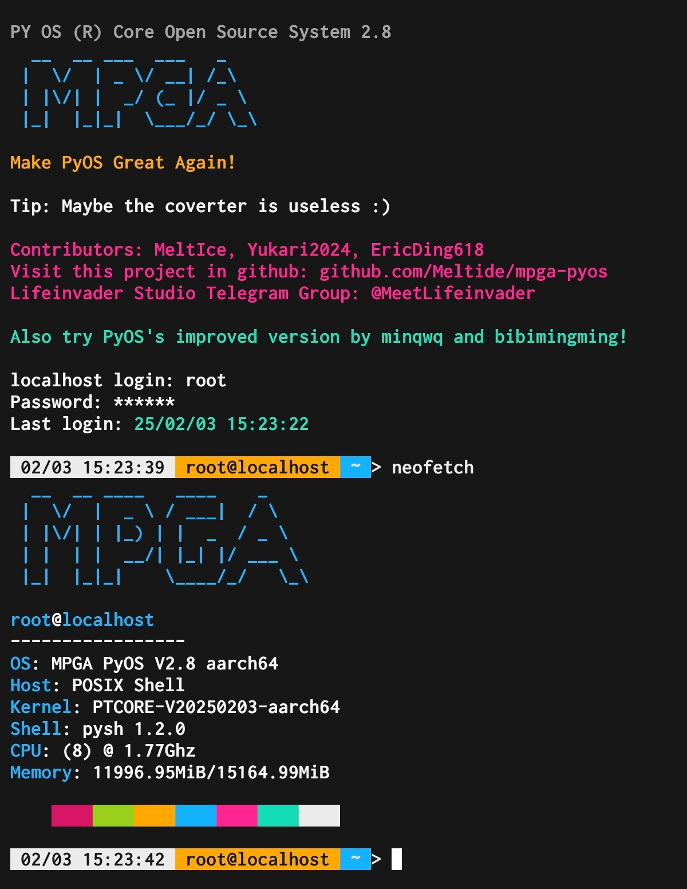
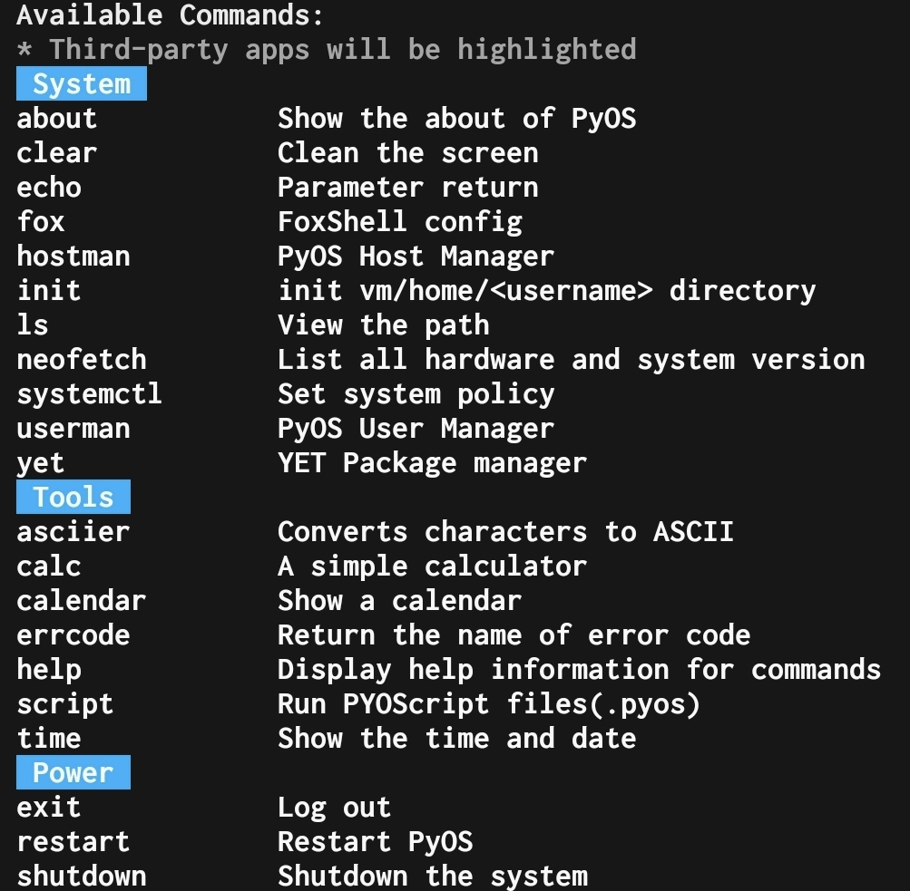

<div align="center">


# MPGA PyOS


 
### 颠覆想象，焕然新生

**M**ake **P**yOS **G**reat **A**gain
<br>
让 PyOS 再次伟大！

</div>

## 使用方法

### 方法1

0. 确保已经安装了 Python 3
1. （可选，使用步骤3更佳）输入命令`pip install -r requirements.txt`来安装依赖
2. 转到 PyOS 所在的目录
3. （可选）输入`.\install.sh`来安装[子模块](https://github.com/Meltide/mpga-apps)和依赖
4. （可选）输入`.\update.sh`来更新[子模块](https://github.com/Meltide/mpga-apps)
5. 输入 `python pyos.py` 来启动

### 方法2

> [!TIP]
> 此方案需要 Nix

0. 转到 PyOS 所在的目录
1. 输入 `nix-shell` 进入 Nix Shell 环境
2. 输入 `python3 pyos.py` 来启动

> [!WARNING]
> 必须在 `pyos.py` 所在的目录下运行该文件，且不要尝试运行除 `pyos.py` 以外的其他文件，否则可能会因为绝对引用而报错

用户名：**root**
<br>
初始密码：**114514**

输入 `help` 获取帮助

## 界面截图



----
注意：  
- 2.0版本开始 **不再提供** 已编译exe文件，请直接下载源码！   
- 请确保 **您的 Python 版本 >= 3.10** ！

```
pyos_core
├─ cmdList
│  ├─ about.py
│  ├─ asciier.py
│  ├─ calc.py
│  ├─ calendar.py
│  ├─ cat.py
│  ├─ clear.py
│  ├─ echo.py
│  ├─ egg
│  │  └─ ciallo.mpk
│  ├─ errcode.py
│  ├─ exec.py
│  ├─ exit.py
│  ├─ fileman.py
│  ├─ fox.py
│  ├─ help.py
│  ├─ hostman.py
│  ├─ init.py
│  ├─ ls.py
│  ├─ neofetch.py
│  ├─ restart.py
│  ├─ script.py
│  ├─ shutdown.py
│  ├─ su.py
│  ├─ sysname.py
│  ├─ systemctl.py
│  ├─ time.py
│  ├─ userman.py
│  └─ yet.py
├─ configs
│  ├─ commands.json
│  ├─ permissions.json
│  ├─ profiles.json
│  ├─ PyOS
│  │  └─ startup_msg.txt
│  ├─ system_policys.json
│  └─ Users
│     ├─ root
│     │  ├─ Fox
│     │  │  ├─ fox_config.json
│     │  │  └─ fox_greeting.txt
│     │  ├─ user_policys.json
│     │  └─ yet_config.json
│     └─ Template
│        ├─ Fox
│        │  ├─ fox_config.json
│        │  └─ fox_greeting.txt
│        ├─ user_policys.json
│        └─ yet_config.json
├─ LICENSE
├─ PYOScript
│  ├─ demo
│  │  └─ t1.mcfunction
│  ├─ highlight_cli.py
│  ├─ interpreter.py
│  ├─ lexer.py
│  ├─ README.md
│  ├─ __compiler.py
│  ├─ __interpreter.py
│  └─ __lexer.py
├─ README.md
├─ requirements.txt
├─ res
│  ├─ logo.png
│  ├─ ui1.jpg
│  └─ ui2.jpg
├─ safety.py
├─ scripts
│  ├─ install.sh
│  └─ update.sh
├─ shell.nix
├─ src
│  └─ pyos
│     ├─ core
│     │  ├─ init.py
│     │  ├─ login.py
│     │  └─ pyos.py
│     ├─ utils
│     │  ├─ basic.py
│     │  ├─ config.py
│     │  ├─ datastruct.py
│     │  ├─ err.py
│     │  ├─ foxShell.py
│     │  ├─ man.py
│     │  ├─ yet.py
│     │  └─ __init__.py
│     └─ vm
│        ├─ home
│        │  ├─ path.py
│        │  └─ root
│        │     ├─ .about
│        │     ├─ document
│        │     │  └─ test
│        │     ├─ download
│        │     │  └─ test
│        │     ├─ game
│        │     │  └─ test
│        │     ├─ music
│        │     │  └─ test
│        │     ├─ others
│        │     │  └─ test
│        │     ├─ picture
│        │     │  └─ test
│        │     └─ video
│        │        └─ test
│        └─ public
└─ tests
   ├─ t1.mcfunction
   ├─ test_exceptions.py
   └─ test_scripts.py

```